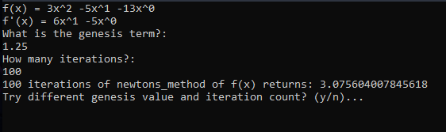

# newton_raphson

 In numerical analysis, Newton's method, 
 also known as the Newton–Raphson method, 
 named after Isaac Newton and Joseph Raphson, 
 is a root-finding algorithm which produces 
 successively better approximations to the roots of a real-valued function.
 
 This is implemented in c++.  
 
 My program parses input and converts the string to a workable polynomial function.  
 It will then calculate the derivative of the function.  
 Then using Newton_Raphson root-approximation, finds the root(s) of the function.  
 
 
 **sample I/O:**
 
 
